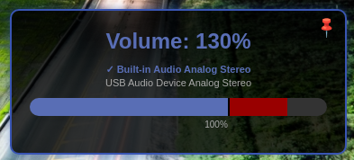

# Linux Volume OSD Popup Project

**Current Version: 2.0**

A Python-based On-Screen Display (OSD) for volume control using PyQt5 and QtWebEngine.

## Features

- Displays volume changes with a visual popup.
- Supports muted state with dedicated icon and messaging.
- Simple HTML and CSS styling for ease of customization.
- Uses a persistent server to update content smoothly.
- Persists across all Workspace, and appears on the screen where the mouse cursor resides.
- Designed for Linux and integrated with PulseAudio/Pipewire.
- Tested to run successfully in Mint 22 MATE and Mint 22.1 Cinnamon.

## Screenshots

OSD Excess Volume with Opacity Example



OSD In Action


## Installation Requirements

- **Python 3.6+**
- **PyQt5** (with QtWebEngine support)
- Linux desktop environment (X11 or Wayland)
- **Additional Packages:**  
  Install on Debian/Ubuntu with:
  ```bash
  sudo apt install python3-pyqt5 python3-pyqt5.qtwebengine
  ```


## Setup

1. Clone the repository:
   ```bash
   git clone https://github.com/spuddermax/linux-volume-osd.git
   cd linux-volume-osd
   ```

2. Make sure the scripts are executable:
   ```bash
   chmod +x call_osd.sh show_osd.py lowvolume.sh
   ```

3. To run the OSD, use the wrapper script with the appropriate command:

Volume up:
   ```bash
   ./call_osd.sh volume-up
   ```

Volume down:
   ```bash
   ./call_osd.sh volume-down
   ```

Mute/Unmute:
   ```bash
   ./call_osd.sh volume-mute
   ```

Run the server directly with a custom value:
   ```bash
   ./call_osd.sh --template volume --value 75
   ```

## Usage

All volume controls are now integrated into the `call_osd.sh` wrapper script:

- **Volume Up:** `./call_osd.sh volume-up`  
- **Volume Down:** `./call_osd.sh volume-down`  
- **Mute/Unmute:** `./call_osd.sh volume-mute`  
- **Set Low Volume (optional):** `./lowvolume.sh`  

## Configuration

The OSD can be configured using the `osd_settings.json` file which is automatically created on first run. This file allows you to customize:

- `window_width`: Width of the OSD window in pixels
- `window_height`: Height of the OSD window in pixels
- `x_offset`: Horizontal position of the OSD (0 for center, positive values offset from right edge, negative values offset from left edge)
- `y_offset`: Vertical position of the OSD (0 for center, positive values offset from bottom edge, negative values offset from top edge)
- `duration`: How long the OSD remains visible (in milliseconds)
- `volume_step`: Amount to increase/decrease volume with each volume-up/volume-down command (max: 20)

Example settings file:
```json
{
    "window_width": 420,
    "window_height": 200,
    "x_offset": 0,
    "y_offset": 40,
    "duration": 2000,
    "volume_step": 5
}
```

Changes to the settings file take effect immediately without needing to restart the server. This includes window size adjustments, which will be applied on the next OSD update. Deleting the settings file will result in the default settings being re-applied on the next OSD update.

## Command-line Arguments

The OSD supports the following command-line arguments:

### Volume Control Commands
- `volume-up`: Increase volume by the configured volume step (customizable in settings file)
- `volume-down`: Decrease volume by the configured volume step (customizable in settings file)
- `volume-mute`: Toggle mute state

### Advanced OSD Options
- `--template`: HTML template name (e.g., volume)
- `--value`: Value to display (e.g., volume percentage)
- `--muted`: Flag to show the muted state (for volume)
- `--debug`: Enable extra debug mode

Note: Display duration and volume step are controlled via the settings file.

## Architecture

The system uses a client-server architecture:

1. The `call_osd.sh` script is the entry point that handles command-line options
2. The `show_osd.py` script contains the main Python code that:
   - Controls audio devices through PulseAudio
   - Manages the OSD display through PyQt5
   - Maintains a socket server for updates without restarting

## Customization

The OSD appearance can be customized by:

1. Editing the HTML templates in the `templates/` directory
2. Modifying CSS styles within these templates
3. Creating new templates for different types of notifications

When customizing templates, be mindful of:
- Template dimensions should fit within the window size defined in `osd_settings.json`
- CSS width/height properties in templates should be adjusted accordingly
- If you create templates of varying sizes, you may need to adjust window dimensions in settings

The content div in `index.html` provides the base structure, while specific templates (like `volume.html`) define the actual content displayed.

## Window Positioning

The OSD will automatically:
- Appear on the screen where your cursor is currently located
- Position itself according to the x_offset and y_offset values in the settings file
- Use fixed dimensions based on window_width and window_height in the settings file

Positioning Guide:
- Center (both axes): x_offset=0, y_offset=0
- Top-right corner: x_offset=40, y_offset=-40
- Bottom-left corner: x_offset=-40, y_offset=40

You can adjust the window dimensions in the settings file to accommodate your templates. The window size will update on the next OSD display without requiring a server restart.

## Key Bindings

You can create your own custom key bindings to replace the default volume controls of your system as desired.
Ask Google or your favorite AI how to do this if you're not sure.

## Bonus Script

An optional low volume adjuster script is included, `./lowvolume.sh`, and was created to allow one to adjust the
low-end volume on headphones or whatever device one might need. The low-end volume was found to be too loud, and
dropping the volume to around 20% in the case in question would be too loud for the bottom end, but going less
than 20% the sound would mute. Thus, this was built so at least at around 20% the volume is barely audible.
Use at your own discretion.

## Contributing

Feel free to open issues, submit pull requests, or contribute with new features. Please review our [CONTRIBUTING.md](CONTRIBUTING.md) for details.

## License

This project is licensed under the MIT License - see the [LICENSE](LICENSE) file for details.

## Version History

### Version 2.0
- Added pinning functionality
- Added listing of all available audio sinks with selection of the active sink
- Added configurable volume step (customize in settings file)
- Volume step can be set between 1-20 (default: 2)
- Code refactoring for improved maintainability
- Enhanced error handling and logging
- Various performance improvements

### Version 1.0
- Initial release
- Basic volume control with OSD display
- Support for mute/unmute
- Multi-screen support
- Customizable position and duration