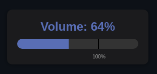
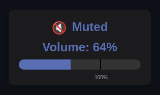
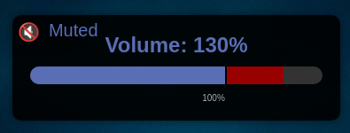
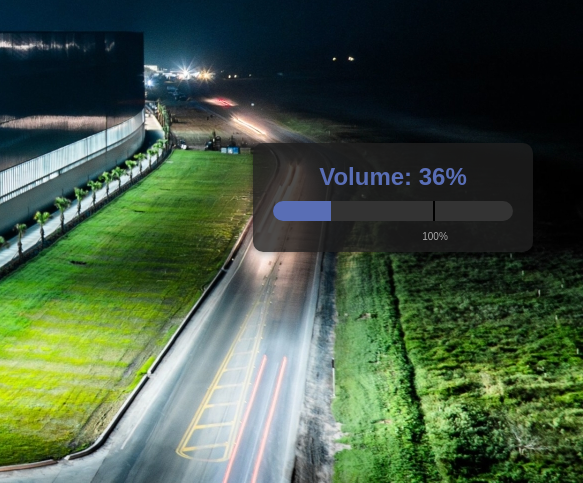

# Linux Volume OSD Popup Project

A Python-based On-Screen Display (OSD) for volume control using PyQt5 and QtWebEngine.

## Features

- Displays volume changes with a visual popup.
- Supports muted state with dedicated icon and messaging.
- Uses a persistent server to update content smoothly.
- Persists across all Workspace, and appears on the screen where the mouse cursor resides.
- Designed for Linux and integrated with Pipewire.
- Tested to run successfully in Mint 22 MATE and Mint 22.1 Cinnamon.

## Installation Requirements

- **Python 3.6+**
- **PyQt5** (with QtWebEngine support)
- Linux desktop environment (X11 or Wayland)
- **Additional Packages:**  
  Install on Debian/Ubuntu with:
  ```bash
  sudo apt install python3-pyqt5 python3-pyqt5.qtwebengine
  ```
## Screenshots

OSD Popup Example




OSD Muted Example




OSD Excess Volume Example



OSD Opacity Example



## Setup

1. Clone the repository:
   ```bash
   git clone https://github.com/spuddermax/linux-volume-osd.git
   cd linux-volume-osd
   ```

2. Make sure the scripts are executable:
   ```bash
   chmod +x run_osd.sh show_osd.py volume-up.sh volume-down.sh volume-mute.sh lowvolume.sh
   ```

3. To run the OSD run the server wrapper script directly, or run any of the three volume adjustment scripts and the server will be started automatically, e.g.:

Volume up:
   ```bash
   ./volume-up.sh
   ```

Run the server directly (This will start the server in the background, and you will need to use a kill command or kill it from the System Monitor if you want it to stop. Better handling of this to come later, I hope):
   ```bash
   ./run_osd.sh --template volume --value 75
   ```

## Usage

- **Volume Up:** `./volume-up.sh`  
- **Volume Down:** `./volume-down.sh`  
- **Mute/Unmute:** `./volume-mute.sh`  
- **Set Low Volume (optional):** `./lowvolume.sh`  

## Contributing

Feel free to open issues, submit pull requests, or contribute with new features. Please review our [CONTRIBUTING.md](CONTRIBUTING.md) for details.

## License

This project is licensed under the MIT License - see the [LICENSE](LICENSE) file for details.